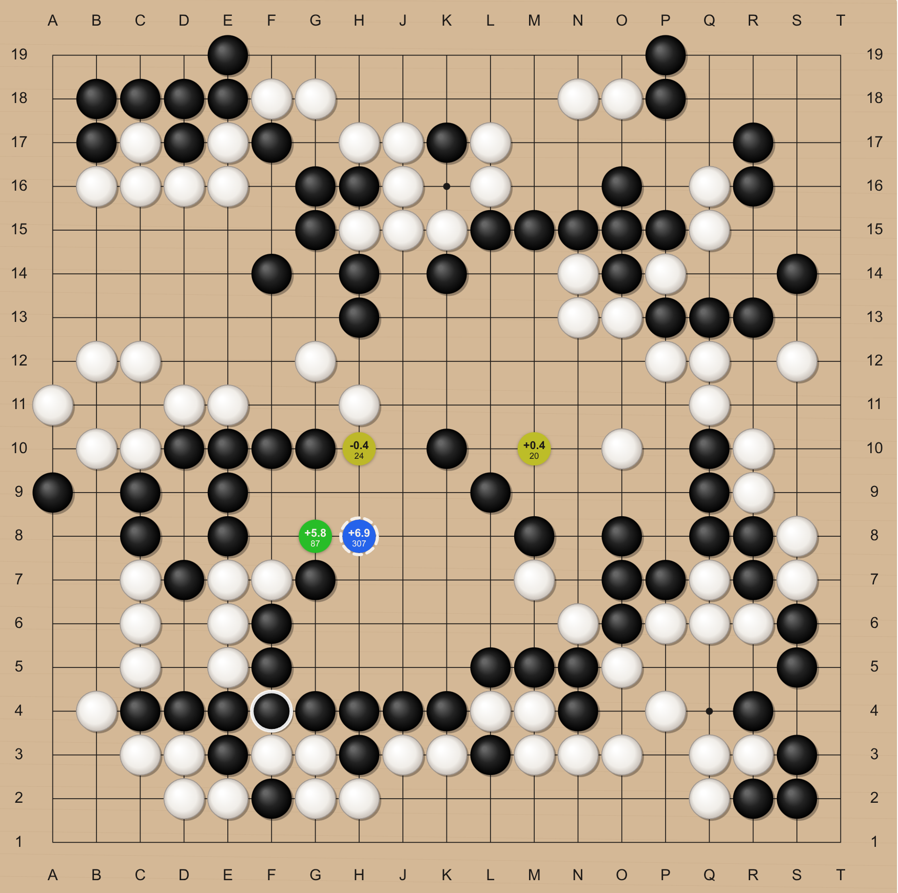
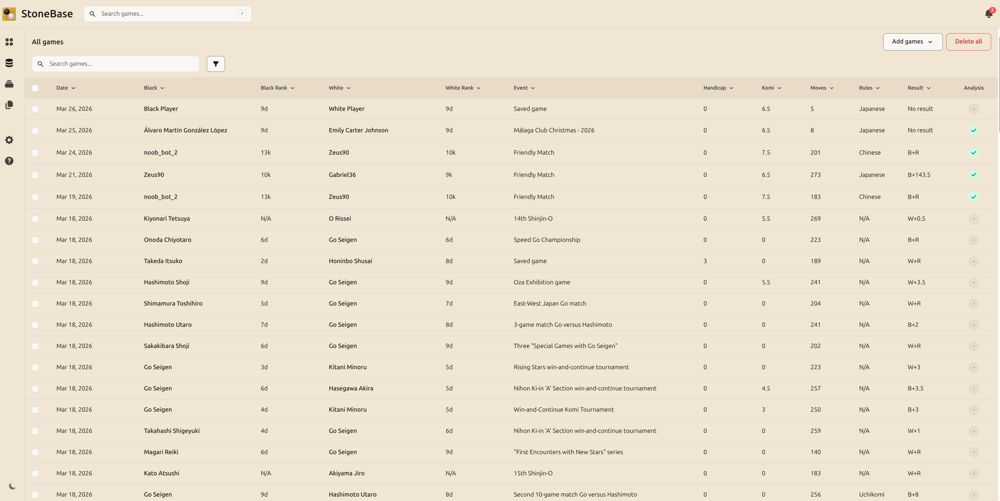

  

<h1 align="center">StoneBase</h1>

  <strong>AI-powered Go (Baduk) game review for desktop</strong> 
  Import your SGF files, analyze every move with KataGo, and sharpen your game.

  
  
  
  

---

  

## Features

| | Free | Pro | Max |
|---|:---:|:---:|:---:|
| SGF import & export (single, batch, folder) | x | x | x |
| OGS integration (browse & import from Online Go Server) | x | x | x |
| Interactive board with move markers & variation preview | x | x | x |
| Move tree navigation with branching variations | x | x | x |
| Board annotations (circles, squares, triangles, labels) | x | x | x |
| Board & stone style customization (6 boards, 3 stone styles) | x | x | x |
| Game categories (assign, edit, bulk-update) | x | x | x |
| Advanced game search & filters (player, date, rules, rank, komi, handicap, etc.) | x | x | x |
| Local KataGo AI analysis | x | x | x |
| Sound effects | x | x | x |
| Update notifications (checks for new versions on startup) | x | x | x |
| Multi-language interface (English, Spanish) | x | x | x |
| Game library limit | 50 | Unlimited | Unlimited |
| Batch AI analysis with progress tracking | | x | x |
| Position search with symmetry matching (Lucene-powered) | | x | x |
| Duplicate detection & merge | | x | x |
| Batch ZIP export | | x | x |
| Use on up to 3 devices | | x | x |
| Cloud KataGo (no local GPU needed) | | | x |
| Stronger neural networks & faster analysis | | | x |

> **Supporter tier** (€2.99/mo or €24/year, coming soon) — lifts the 50-game cap with no other Pro features, for players who want unlimited library access and to support the project. Also includes use on up to 3 devices.
>
> See full pricing and details at **[gostonebase.com](https://gostonebase.com)**.

<strong>Game library</strong>

 

## Download

Grab the latest release for your platform from the **[Releases](https://github.com/DroidLogic/StoneBase/releases/latest)** page:

| Platform | Installer |
|---|---|
| Windows | `.msi` |
| macOS | `.dmg` |
| Linux (Debian/Ubuntu) | `.deb` |

## How It Works

1. **Import** — Upload your SGF files individually, in batches, or by folder. You can also browse and import games directly from the [Online Go Server](https://online-go.com). StoneBase parses and indexes every game automatically.
2. **Analyze** — KataGo evaluates each move with win rates, score estimates, candidate moves, and principal variations.
3. **Improve** — Review mistakes, explore better lines, search for patterns, and track your progress.

All your games and analysis data stay on your machine — nothing is sent to the cloud.

## Feedback & Issues

This repository is the place to report bugs, request features, and share feedback.

- **[Open an issue](https://github.com/DroidLogic/StoneBase/issues/new)** for bug reports or feature requests.
- **[View open issues](https://github.com/DroidLogic/StoneBase/issues)** to see what's being tracked.
- **[Join the Discord](https://discord.gg/Yz8GzE3A6)** for discussion and community support.

## Links

- **Website:** [gostonebase.com](https://gostonebase.com)
- **Blog:** [gostonebase.com/blog](https://gostonebase.com/blog/)
- **Discord:** [discord.gg/Yz8GzE3A6](https://discord.gg/Yz8GzE3A6)
- **Reddit:** [r/StoneBase](https://www.reddit.com/r/StoneBase/)
- **KataGo:** [github.com/lightvector/KataGo](https://github.com/lightvector/KataGo)
